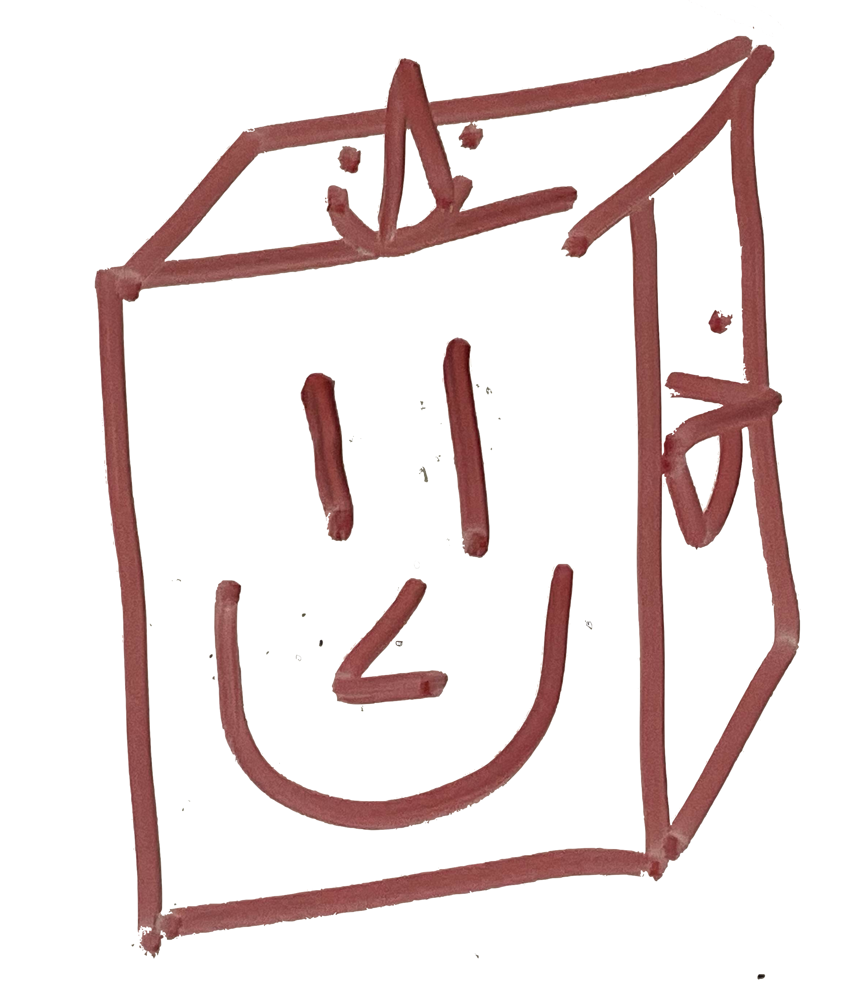

    
    <h1 align="center">Shrine</h1>

>We have builded a visible temple; we have set us a tangible sign.
>
>For a symbol of that truer temple; a mark of that holier shrine.
>
>And nought of war's long tarnished story; dwells there, not of pride nor of pain.
>
>But all that remains of their glory; who died not in vain.
>
>*Clarence Michael James Stanislaus Dennis, The Shrine*

## Introduction

Shrine is a web-based application that helps clients safely store and retrieve passwords with ease. With a elegant user interface, secure encoding and decoding methods, reliable server calls, as well as rich features, clients may experience password management in a whole new way.

## Features

- Username and passwords provided by users will be saved in the server database.

- Added username and passwords will be displayed on the website, avaiable for viewing, copying, and editing.

- Users may search for website name or username to retrieve certain passwords.

- Aside from the basic website name, username, and password, store two factor autehtication (TOTP and HOTP) keys and dynamically generate dynamic codes.

- Provide a random password generator to create stronger and safer passwords.

- Notify users of repeated and unsafe (breached) passwords.
## Contributers

Shrine is a collaboration project at UCLA CS35L. Team members:
- Alan Yu [azy7@g.ucla.edu](mailto:azy7@g.ucla.edu)
- Chentyi Zhang [chriszhang09@g.ucla.edu](mailto:chriszhang09@g.ucla.edu)
- Randy Gu [rgu855@163.com](mailto:rgu855@163.com)
- Jin Zhang [sh3l6or@icloud.com](mailto:sh3l6or@icloud.com)
- Hanry Xu [hanryxu@ucla.edu](mailto:hanryxu@ucla.edu)
